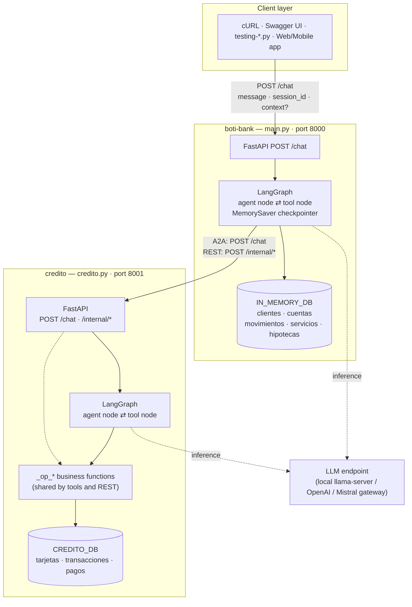
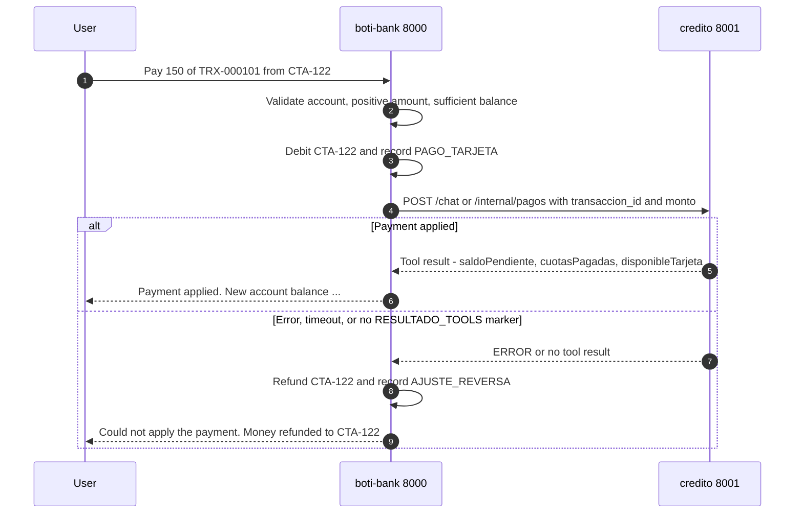

# BotiBank — Multi-Agent Banking Assistant


A conversational banking demo built with **LangGraph** (reasoning + tool calling) and **FastAPI**
(HTTP surface). It is made of **two independent agents** that talk to each other over HTTP:

| Agent | File | Port | Owns |
| :--- | :--- | :--- | :--- |
| **`boti-bank`** | `main.py` | `8000` | Customers, bank accounts, transactions, utility bills, mortgages |
| **`credito`** | `credito.py` | `8001` | Credit cards, instalment purchases, card payments, risk scoring |

When a user asks `boti-bank` anything about credit cards, `boti-bank` does **not** answer by itself:
it calls the `credito` agent and relays its verdict. That agent-to-agent (**A2A**) hop is the point
of this project.

Both agents keep all their data in a Python dictionary in RAM — no database, no disk. Restarting a
process resets its world.

> This README is the single source of truth for the project: what it does, how to run it, and why it
> is built this way.

---

## Table of contents

- [Architecture](#architecture)
- [Design decisions](#design-decisions)
- [Repository layout](#repository-layout)
- [Quick start](#quick-start)
- [Configuration](#configuration)
- [Tool reference](#tool-reference)
- [How the two agents talk (A2A)](#how-the-two-agents-talk-a2a)
- [Credit policy (deterministic scoring)](#credit-policy-deterministic-scoring)
- [HTTP API reference](#http-api-reference)
- [Seed data](#seed-data)
- [Testing and guided walkthrough](#testing-and-guided-walkthrough)
- [Deploying to WSO2 Agent Manager](#deploying-to-wso2-agent-manager)
- [Known limitations](#known-limitations)

---

## Architecture



**The LangGraph loop** (identical in both agents):

```
                  ┌─────────────────────────────┐
                  │                             │
                  ▼                             │
  START ──▶ ┌───────────┐   tool_calls?  ┌──────────────┐
            │   agent   │ ──── yes ────▶ │  tool node   │
            │ (LLM call)│                │ (runs tools) │
            └───────────┘                └──────────────┘
                  │
                  └──── no ────▶ END   (reply goes back to the caller)
```

**Ownership rule:** account money is *always* moved by `boti-bank`; credit (limit, instalments,
card balance) is *always* moved by `credito`. Neither agent writes into the other's store.
Communication is one-directional — `credito` never calls back into `boti-bank`, so there are no A2A
cycles.

---

## Design decisions

Why the project looks like this, and what was deliberately *not* done.

### Why two agents instead of one with more tools

1. **It is the A2A use case being demonstrated** in Agent Manager — two components, two endpoints,
   two API keys.
2. **It isolates the risk policy** (scoring) from the transactional core.
3. **It keeps each agent's tool set small.** This is the non-obvious one: with an 8B model
   (`hermes-2-pro-llama3-8b`), tool-selection accuracy degrades noticeably past roughly 8–10 tools.
   Merging the two agents would push `boti-bank` well over that line.

> ⚠️ If you are tempted to "simplify" this into a single agent with 12 tools, point 3 is the reason
> it was not done that way.

### Why the card payment debits first and compensates on failure

`credito_abonar` touches both stores and there is no distributed transaction, so the order is
chosen, not incidental: **the locally reversible, no-network step goes first; the remote step goes
last.** If the remote call fails, the local debit is compensated (`AJUSTE_REVERSA`). The reverse
order would leave credit applied against money that was never taken.

### Why `cuenta_origen` is the one thing the user must supply

Every other value the agents can derive on their own. The source account cannot be inferred — Ana
has three. This is the single point in the flow where full autonomy is deliberately broken, and it
is broken there on purpose rather than guessing which account to drain.

### Alternatives considered and rejected

Both are reversible without touching the architecture, if you want a simpler demo:

| Decision taken | Alternative rejected | Trade-off |
| :--- | :--- | :--- |
| The payment debits a **real bank account**, with compensation | Have `abonar_tarjeta` only record the payment inside `credito`, touching no account | Simpler — removes the cross-store consistency problem entirely — but much less realistic |
| **One active card per customer** (a second application returns the existing one) | Allow several cards per customer | Would force every tool to take an explicit `tarjeta_id`, complicating the conversational flow |

---

## Repository layout

| Path | What it is |
| :--- | :--- |
| `main.py` | **`boti-bank` agent.** In-memory bank DB, 7 banking tools + 4 `credito_*` bridge tools, LangGraph graph, `POST /chat`. |
| `credito.py` | **`credito` agent.** In-memory credit DB, deterministic risk policy, 5 tools, `POST /chat` **and** `/internal/*` REST endpoints. |
| `main-mistral.py` | Variant of `main.py` that talks to a **Mistral** endpoint (`ChatMistralAI`) behind a gateway that authenticates with an `API-Key` header instead of `Authorization: Bearer`. Same tools, same graph. |
| `botibank.yaml` | OpenAPI 3.0 description of the **banking domain** (customers, accounts, services, mortgages). Reference/contract document — note that `main.py` itself only serves `POST /chat`. |
| `credito.yaml` | OpenAPI 3.0 spec of the `credito` component: `/chat` plus the `/internal/*` endpoints. This is what gets registered in Agent Manager. |
| `testing-boti.py` | Interactive test harness against `boti-bank` — two question batteries (banking, and credit via A2A). |
| `testing-credito.py` | Interactive test harness against the `credito` agent's `/chat`, sending hard data in `context`. |
| `.env` / `.env-mistral` | Environment configuration (see [Configuration](#configuration)). ⚠️ Both are **tracked in git** and `.gitignore` does not exclude them — see the warning under [Configure](#3-configure). |
| `requirements.txt` | Pinned dependencies. |

---

## Quick start

### 1. Requirements

- Python **3.10+** (this repo was developed on 3.14)
- An **OpenAI-compatible** chat endpoint that supports **tool / function calling**. Any of:
  - a local `llama-server` running e.g. `hermes-2-pro-llama3-8b`
  - the OpenAI API
  - a Mistral endpoint (use `main-mistral.py`)

### 2. Install

```bash
python3 -m venv .venv
source .venv/bin/activate          # Windows: .venv\Scripts\activate
pip install -r requirements.txt
```

> This repo ships with a virtualenv already created **at the repository root**
> (`bin/`, `lib/`, `pyvenv.cfg` — all git-ignored). If you are using that one instead, drop the
> `venv` step and prefix commands with `./bin/python`, as the walkthrough below does.

### 3. Configure

Create a `.env` in the repo root (see [Configuration](#configuration) for every variable):

```dotenv
# LLM
MODEL_BASE_URL=http://127.0.0.1:8081/v1
MODEL_API_KEY=not-needed
MODEL_NAME=hermes-2-pro-llama3-8b

# Agent-to-agent
CREDITO_AGENT_URL=http://127.0.0.1:8001/chat
CREDITO_AGENT_API_KEY=
CREDITO_MODE=a2a
CREDITO_TIMEOUT=45

# Servers
API_HOST=127.0.0.1
API_PORT=8000
CREDITO_API_PORT=8001
```

> ⚠️ **Before you put a real key in here.** `.env` and `.env-mistral` are currently **tracked in
> git**, and `.gitignore` does not exclude them. They hold no real secret today — the committed
> `MODEL_API_KEY` is the same placeholder as the in-code default — but the moment someone pastes a
> real WSO2 or OpenAI key and commits, it is in the history. Before sharing this repo, consider
> `git rm --cached .env .env-mistral`, adding `.env*` to `.gitignore`, and committing a
> `.env.example` with placeholder values instead.

### 4. Run both agents

Start `credito` **first** — `boti-bank` needs it to be up before any credit question:

```bash
# Terminal 1 — credit agent
python -m uvicorn credito:app --host 127.0.0.1 --port 8001

# Terminal 2 — main banking agent
python -m uvicorn main:app --host 127.0.0.1 --port 8000
```

Swagger UI is available at `http://127.0.0.1:8000/docs` and `http://127.0.0.1:8001/docs`.

### 5. Talk to it

```bash
# Plain banking question — resolved entirely by boti-bank
curl -X POST http://127.0.0.1:8000/chat \
  -H "Content-Type: application/json" \
  -d '{
        "message": "List all the bank customers.",
        "session_id": "demo-01"
      }'

# Credit question — boti-bank delegates to the credito agent over A2A
curl -X POST http://127.0.0.1:8000/chat \
  -H "Content-Type: application/json" \
  -d '{
        "message": "Can customer Ana, ID 71992c72-cc1c-4c5a-8b50-9ee4fb6c214d, get a credit card?",
        "session_id": "demo-cards-01"
      }'
```

> The agents' system prompts and seed data are in **Spanish**, so the models answer in Spanish.
> They understand questions in either language.

---

## Configuration

All variables are read with `os.getenv` at import time and loaded from `.env` via `python-dotenv`.

| Variable | Used by | Default | Purpose |
| :--- | :--- | :--- | :--- |
| `MODEL_BASE_URL` | both | `http://127.0.0.1:8081/v1` | OpenAI-compatible chat completions base URL. |
| `MODEL_API_KEY` | both | `sk-mi-clave-secreta-123` | API key for the LLM endpoint (`not-needed` for most local servers). |
| `MODEL_NAME` | both | `hermes-2-pro-llama3-8b` | Model id requested from that endpoint. |
| `MODEL_TIMEOUT` | `main-mistral.py` | `120` | HTTP timeout (seconds) for the Mistral client. |
| `API_HOST` | both | `0.0.0.0` | Bind address when run as `python main.py` / `python credito.py`. |
| `API_PORT` | `main.py` | `8000` | `boti-bank` port. |
| `CREDITO_API_PORT` | `credito.py` | `8001` | `credito` port. |
| `CREDITO_AGENT_URL` | `main.py` | `http://127.0.0.1:8001/chat` | The `credito` agent's `/chat` URL. |
| `CREDITO_BASE_URL` | `main.py` | derived from `CREDITO_AGENT_URL` | Base URL used for `/internal/*` calls. Set it only if it can't be derived by stripping `/chat`. |
| `CREDITO_AGENT_API_KEY` | `main.py` | *(empty)* | Sent as `x-api-key` when calling `credito`. Leave empty locally. |
| `CREDITO_MODE` | `main.py` | `a2a` | `a2a` = call `credito`'s `/chat`; `rest` = call its `/internal/*` endpoints. |
| `CREDITO_TIMEOUT` | `main.py` | `45` | Seconds to wait for the credit agent. A2A means two chained inferences, so keep it generous. |
| `AGENT_URL` | `testing-boti.py` | *(WSO2 URL)* | Where the test harness posts. |
| `AGENT_API_KEY` | `testing-boti.py` | *(empty)* | `x-api-key` for that endpoint. |

---

## Tool reference

### `boti-bank` — banking tools (`main.py`)

| Tool | Signature | What it does |
| :--- | :--- | :--- |
| `listar_clientes` | `()` | Returns every customer in the bank. |
| `consultar_cuentas` | `(cliente_id)` | Lists the customer's accounts with their balances. |
| `ingresar_dinero` | `(cuenta_id, monto)` | Deposits money into an account and records an `INGRESO` movement. |
| `transferir_dinero` | `(cuenta_origen, cuenta_destino, monto, concepto)` | Transfers between accounts after checking the source balance; records both legs. |
| `listar_servicios` | `()` | Lists outstanding utility bills (electricity, water, internet). |
| `pagar_servicio` | `(cuenta_origen, codigo_servicio)` | Pays a bill, debits the account and removes the bill from the list. |
| `pagar_hipoteca` | `(cuenta_origen, id_hipoteca, monto)` | Makes a partial mortgage payment and recomputes the outstanding balance. |

### `boti-bank` — bridge tools into the credit agent

| Tool | Signature | What it does |
| :--- | :--- | :--- |
| `credito_solicitar_tarjeta` | `(cliente_id)` | Builds the customer's **financial profile locally** and asks `credito` to score and issue a card. Returns approval, card id, limit and available credit. |
| `credito_comprar` | `(tarjeta_id, objeto, cuotas, monto_cuota)` | Registers an instalment purchase. Returns the transaction id and remaining credit. |
| `credito_abonar` | `(transaccion_id, monto, cuenta_origen)` | **The only cross-store operation.** Debits a real bank account, then asks `credito` to apply the payment — and reverses the debit if that fails. |
| `credito_estado` | `(cliente_id)` | Returns the customer's cards: limit, available credit, debt and live instalment purchases with their transaction ids. |

### `credito` — credit tools (`credito.py`)

| Tool | Signature | What it does |
| :--- | :--- | :--- |
| `solicitar_tarjeta_credito` | `(cliente_id, titular, ingreso_mensual, saldo_total, cuota_deuda_mensual)` | Applies the deterministic risk policy and issues the card if it qualifies. **Idempotent**: a customer with an active card gets that card back instead of a new one. |
| `comprar_con_tarjeta` | `(tarjeta_id, objeto, cuotas, monto_cuota)` | Records an instalment purchase, generates `TRX-xxxxxx` and reduces available credit. |
| `abonar_tarjeta` | `(transaccion_id, monto)` | Applies a payment to a transaction, recomputes instalments paid, frees up credit, and closes the transaction (`CANCELADA`) when fully paid. |
| `consultar_tarjetas` | `(cliente_id)` | Lists the customer's cards with limit and available credit. |
| `estado_cuenta_tarjeta` | `(tarjeta_id)` | Statement: total debt, next instalment total, and every live purchase with its transaction id. |

Every credit tool is a thin wrapper over an `_op_*` function. The `/internal/*` REST endpoints call
**the exact same** `_op_*` functions, which is why both integration modes behave identically.

**Core invariant, enforced by `_recalcular_disponible()` after every purchase and payment:**

```
available = limit − Σ(outstanding balance of that card's VIGENTE transactions)
```

---

## How the two agents talk (A2A)

`CREDITO_MODE` selects the transport:

### `a2a` (default) — agent-to-agent

`boti-bank` posts to `credito`'s `/chat`. This is the demo-worthy path: a real conversation between
two LLM agents. Three deliberate design choices make it reliable enough to trust:

**1. Hard data travels in `context`, never in the prose.**
`boti-bank` sends `{"message": "...", "session_id": "...", "context": {...}}`. The `credito` agent
appends the context to the prompt as an explicit `DATOS` block with the instruction to use those
values verbatim — so a small model never has to extract numbers out of a Spanish sentence.

**2. One fresh thread per call.**
Each A2A call uses `botibank-<session>-<random>` as its `session_id` on the child agent. This is an
RPC, not a conversation. Reusing a thread makes history pile up until the small model stops calling
its tools altogether — in one measured run it even replayed the *previous* operation's JSON as the
new answer. Measured: shared thread → 1 of 3 operations actually executed; fresh thread → 3 of 3.

**3. Execution is verified, not trusted.**
`credito`'s `/chat` appends the **real** result of every tool it executed under a
`[RESULTADO_TOOLS]` marker. That block is written by code, not by the model. `boti-bank`'s
`_procesar_a2a()` refuses any response without it.

> This is not paranoia. On the first real run, the 8B model replied *"I registered the purchase"*
> and *"I applied the payment"* **without ever calling the tools** — while `boti-bank` had already
> debited $400 from a real account. Keyword detection didn't catch it, because the reply contained
> no error text. That single run is why the marker exists.

### `rest` — deterministic

`boti-bank` calls `credito`'s `/internal/*` endpoints directly. No intermediate LLM, same return
contract, zero risk of the child model going off-script. Use it as the fallback when the demo has
to just work.

### The delicate case: paying a card

`credito_abonar` is the only operation that touches both stores, and there is no distributed
transaction. The order is deliberate — the local, reversible, no-network step first; the remote step
last; **compensate** if the remote step fails.



Both modes return a string starting with `ERROR` when the payment did not go through, so the
compensation check is a single exact `startswith("ERROR")`.

---

## Credit policy (deterministic scoring)

**The LLM never decides who gets a card or how big the limit is.** It only calls the tool and
reports the verdict. The policy lives in plain Python at the top of `credito.py`:

| Constant | Value | Meaning |
| :--- | :--- | :--- |
| `MIN_INGRESO_MENSUAL` | `400.0` | Below this monthly income, the application is rejected. |
| `DTI_MAXIMO` | `0.50` | Max debt-to-income ratio (existing monthly debt instalments ÷ monthly income). |
| `LIMITE_MINIMO` | `500.0` | Floor for an approved limit. |
| `LIMITE_MAXIMO` | `15000.0` | Ceiling for an approved limit. |
| `MAX_CUOTAS` | `24` | Max instalments per purchase. |

**Decision flow**

1. Already has an `ACTIVA` card? → return it unchanged (idempotent, no re-scoring).
2. `ingreso_mensual < 400` → **rejected**, with the reason.
3. `cuota_deuda_mensual / ingreso_mensual > 0.50` → **rejected**, with the DTI in the reason.
4. Otherwise **approved**, with:

```
capacity = (3 × monthly_income) + (0.20 × total_account_balance) − (2 × monthly_debt_instalments)
limit    = clamp(capacity, 500, 15000)
```

**Where the profile comes from.** `credito` has no access to bank accounts, so `boti-bank` computes
the profile itself in `_perfil_financiero()` and sends it along:

- `ingreso_mensual` — sum of all `INGRESO` + `TRANSFERENCIA_RECIBIDA` movements across the
  customer's accounts, divided by the number of distinct months those movements span.
- `saldo_total` — sum of the balances of all the customer's accounts.
- `cuota_deuda_mensual` — sum of the monthly instalments of the customer's mortgages.

---

## HTTP API reference

### `boti-bank` — `http://127.0.0.1:8000`

**`POST /chat`**

```jsonc
// Request
{
  "message": "List all the bank customers.",   // required
  "session_id": "demo-01",                     // required — LangGraph thread_id, keeps history
  "context": { "any": "json" }                 // optional
}

// Response
{ "response": "..." }
```

`session_id` maps directly onto the LangGraph `thread_id`, so reusing it continues the same
conversation via the in-memory `MemorySaver` checkpointer.

### `credito` — `http://127.0.0.1:8001`

**`POST /chat`** — same schema. When `context` is present it is appended to the prompt as a `DATOS`
block. The response body has the `[RESULTADO_TOOLS] [...]` block appended when tools ran.

**Deterministic endpoints** (no LLM in the path):

| Method | Path | Body / Params | Returns |
| :--- | :--- | :--- | :--- |
| `POST` | `/internal/tarjetas` | `{cliente_id, titular, ingreso_mensual, saldo_total, cuota_deuda_mensual}` | `{aprobada, tarjetaId, limite, disponible, motivo}` |
| `GET` | `/internal/tarjetas/{clienteId}` | — | `{clienteId, cantidad, tarjetas[]}` |
| `GET` | `/internal/tarjetas/{tarjetaId}/estado` | — | Full statement for the card |
| `POST` | `/internal/compras` | `{tarjeta_id, objeto, cuotas, monto_cuota}` | `{transaccionId, montoTotal, disponibleRestante, …}` |
| `POST` | `/internal/pagos` | `{transaccion_id, monto}` | `{pagoId, saldoPendiente, cuotasPagadas, estado, disponibleTarjeta}` |

Business-rule failures return **HTTP 400** with `{"detail": "<reason>"}`.

---

## Seed data

Both agents boot with the same fixed dataset every time, so demos are reproducible.

**Customers & accounts** (`main.py` → `IN_MEMORY_DB`)

| Customer | ID | Accounts (balance) | Mortgage |
| :--- | :--- | :--- | :--- |
| Ana García | `71992c72-cc1c-4c5a-8b50-9ee4fb6c214d` | `CTA-122` Corriente (1 800.50) · `CTA-123` Ahorro (100.00) · `CTA-999` Inversión (0.00) | `HIP-001` — 145 000 left, 800/mo |
| Pablo Saga | `88888888-cc1c-4c5a-8b50-9ee4fb6c214d` | `CTA-444` Sueldo (5 000.00) | `HIP-002` — 50 000 left, 1 200/mo |
| Carlos Pérez | `33333333-cc1c-4c5a-8b50-9ee4fb6c214d` | `CTA-555` Ahorro (250.00) | — |

**Utility bills:** `LZ1` Luz (50.00) · `AG2` Agua (25.50) · `IN3` Internet (40.00)

**Credit cards** (`credito.py` → `CREDITO_DB`)

| Card | Holder | Limit | Available | Live purchases |
| :--- | :--- | :--- | :--- | :--- |
| `TC-4821` | Ana García | 2 755.00 | 2 035.00 | `TRX-000101` notebook, 6×150, 600 left · `TRX-000102` sneakers, 3×40, 120 left |
| `TC-7315` | Pablo Saga | 15 000.00 | 10 600.00 | `TRX-000103` flights, 12×400, 4 400 left *(`TRX-000104` fully paid → `CANCELADA`)* |

Carlos Pérez deliberately has **no card** — he is the fixture for testing the scoring path
(his real profile is rejected for insufficient income).

---

## Testing and guided walkthrough

Everything below was executed against this repo and the outputs are **real**, not illustrative.
Follow it top to bottom and you will exercise the whole system, including the failure path.

### Step 0 — Start from a clean slate

Both agents hold their state in RAM, so **restarting resets everything to the seed data**. Every
number in this walkthrough assumes a fresh start, and the steps are cumulative — run them in order.

```bash
# Terminal 1
./bin/python -m uvicorn credito:app --host 127.0.0.1 --port 8001

# Terminal 2
./bin/python -m uvicorn main:app --host 127.0.0.1 --port 8000
```

Confirm both are up before going on:

```bash
curl -s -o /dev/null -w "credito:   %{http_code}\n" http://127.0.0.1:8001/openapi.json
curl -s -o /dev/null -w "boti-bank: %{http_code}\n" http://127.0.0.1:8000/openapi.json
```

```
credito:   200
boti-bank: 200
```

---

### Track A — the deterministic path (no LLM required)

Hits `credito`'s `/internal/*` endpoints directly. **This is the fastest way to verify the business
logic**, and it works even with no model endpoint configured. Use it to tell "the rules are broken"
apart from "the model misbehaved".

#### A1. What cards does Ana have?

```bash
curl -s http://127.0.0.1:8001/internal/tarjetas/71992c72-cc1c-4c5a-8b50-9ee4fb6c214d
```

```json
{"clienteId":"71992c72-cc1c-4c5a-8b50-9ee4fb6c214d","cantidad":1,
 "tarjetas":[{"tarjetaId":"TC-4821","clienteId":"71992c72-cc1c-4c5a-8b50-9ee4fb6c214d",
 "titular":"Ana García","limite":2755.0,"disponible":2035.0,"estado":"ACTIVA",
 "fechaAlta":"2026-01-15T10:00:00Z"}]}
```

#### A2. Full statement for that card

```bash
curl -s http://127.0.0.1:8001/internal/tarjetas/TC-4821/estado
```

```json
{"tarjetaId":"TC-4821","titular":"Ana García","limite":2755.0,"disponible":2035.0,
 "deudaTotal":720.0,"proximaCuotaTotal":190.0,
 "transaccionesVigentes":[
   {"transaccionId":"TRX-000101","objeto":"Notebook Lenovo IdeaPad","cuotas":6,
    "montoCuota":150.0,"cuotasPagadas":2,"saldoPendiente":600.0},
   {"transaccionId":"TRX-000102","objeto":"Zapatillas running Nike","cuotas":3,
    "montoCuota":40.0,"cuotasPagadas":0,"saldoPendiente":120.0}]}
```

Check the invariant by hand: `2755 − (600 + 120) = 2035`. ✅

#### A3. A rejected application (Carlos)

Carlos's real profile is 375/month, below the 400 minimum:

```bash
curl -s -X POST http://127.0.0.1:8001/internal/tarjetas \
  -H "Content-Type: application/json" \
  -d '{"cliente_id":"33333333-cc1c-4c5a-8b50-9ee4fb6c214d","titular":"Carlos Perez",
       "ingreso_mensual":375.0,"saldo_total":250.0,"cuota_deuda_mensual":0.0}'
```

```json
{"aprobada":false,"tarjetaId":null,"limite":0.0,"disponible":0.0,
 "motivo":"Ingreso mensual estimado (375.00) inferior al minimo requerido (400.00)"}
```

> 💡 **A rejection is HTTP `200`, not `400`.** Turning down an application is a valid business
> answer, carried in `aprobada:false`. Only genuine *errors* (unknown card, insufficient credit,
> bad amount) return `400` with a `detail` field. Do not write a test that treats a rejection as a
> failed request.

#### A4. A purchase in instalments

```bash
curl -s -X POST http://127.0.0.1:8001/internal/compras \
  -H "Content-Type: application/json" \
  -d '{"tarjeta_id":"TC-4821","objeto":"Microondas","cuotas":4,"monto_cuota":75.0}'
```

```json
{"transaccionId":"TRX-000105","tarjetaId":"TC-4821","objeto":"Microondas","cuotas":4,
 "montoCuota":75.0,"montoTotal":300.0,"disponibleRestante":1735.0}
```

Available credit went `2035 → 1735`.

#### A5. A purchase that busts the limit

```bash
curl -s -X POST http://127.0.0.1:8001/internal/compras \
  -H "Content-Type: application/json" \
  -d '{"tarjeta_id":"TC-4821","objeto":"Auto usado","cuotas":12,"monto_cuota":1000.0}'
```

```json
{"detail":"credito disponible insuficiente: la compra suma 12000.00 y la tarjeta TC-4821 tiene 1735.00 disponible"}
```

HTTP `400`. Nothing was written.

#### A6. Paying an instalment

```bash
curl -s -X POST http://127.0.0.1:8001/internal/pagos \
  -H "Content-Type: application/json" \
  -d '{"transaccion_id":"TRX-000101","monto":150.0}'
```

```json
{"pagoId":"PG-000005","transaccionId":"TRX-000101","objeto":"Notebook Lenovo IdeaPad",
 "montoAbonado":150.0,"saldoPendiente":450.0,"cuotasPagadas":3.0,"cuotasRestantes":3.0,
 "estado":"VIGENTE","disponibleTarjeta":1885.0}
```

Paying 150 freed exactly 150 of credit: `1735 → 1885`.

#### A7. Overpaying is refused

```bash
curl -s -X POST http://127.0.0.1:8001/internal/pagos \
  -H "Content-Type: application/json" \
  -d '{"transaccion_id":"TRX-000102","monto":999.0}'
```

```json
{"detail":"el abono (999.00) supera el saldo pendiente de la transaccion (120.00); aboná como maximo ese monto"}
```

---

### Track B — the conversational path (needs a working LLM)

Same operations in natural language, through `boti-bank`, which delegates over A2A. **Restart both
agents before starting this track** so the numbers below match.

> The models answer in Spanish and the exact wording changes between runs — that is normal. The
> **numbers** are what you check.

#### B1. A plain banking question (no A2A hop)

```bash
curl -s -X POST http://127.0.0.1:8000/chat \
  -H "Content-Type: application/json" \
  -d '{"message":"Enumera todos los clientes del banco.","session_id":"wt-01"}'
```

```json
{"response":"Los clientes del banco son:\n\n1. Ana García - ID: 71992c72-cc1c-4c5a-8b50-9ee4fb6c214d - Email: ana@ejemplo.com\n2. Pablo Saga - ID: 88888888-...\n3. Carlos Pérez - ID: 33333333-..."}
```

#### B2. Ana's accounts — note the balance, you will need it in B6

```bash
curl -s -X POST http://127.0.0.1:8000/chat \
  -H "Content-Type: application/json" \
  -d '{"message":"¿Cuáles son las cuentas y saldos de la clienta con ID 71992c72-cc1c-4c5a-8b50-9ee4fb6c214d?","session_id":"wt-02"}'
```

```
CTA-122 Corriente: $1800.50 · CTA-123 Ahorro: $100.00 · CTA-999 Inversión: $0.00
```

#### B3. The A2A hop — can Ana get a card?

This is the interesting one: `boti-bank` computes her profile locally, calls `credito`, and relays
the verdict.

```bash
curl -s -X POST http://127.0.0.1:8000/chat \
  -H "Content-Type: application/json" \
  -d '{"message":"¿Puede la clienta Ana, con ID 71992c72-cc1c-4c5a-8b50-9ee4fb6c214d, sacar una tarjeta de crédito? Decime el límite y el disponible.","session_id":"wt-03"}'
```

```json
{"response":"La clienta Ana ... puede sacar una tarjeta de crédito. Su límite será de $2755 y tendrá disponible $2035 para gastar. Sin embargo, ya tenía una tarjeta activa, por lo que no se le emitirá una nueva."}
```

That last clause is the **idempotency rule** firing — she already has `TC-4821`.

#### B4. A rejection, relayed faithfully

```bash
curl -s -X POST http://127.0.0.1:8000/chat \
  -H "Content-Type: application/json" \
  -d '{"message":"¿Y el cliente Carlos, con ID 33333333-cc1c-4c5a-8b50-9ee4fb6c214d, puede sacar una tarjeta de crédito?","session_id":"wt-04"}'
```

```json
{"response":"El cliente ... no puede sacar una tarjeta de crédito en este momento. Su ingreso mensual estimado es inferior al mínimo requerido."}
```

`boti-bank` did not decide this — it repeated `credito`'s verdict.

#### B5. Buying in instalments, in natural language

```bash
curl -s -X POST http://127.0.0.1:8000/chat \
  -H "Content-Type: application/json" \
  -d '{"message":"Comprá un microondas con la tarjeta TC-4821 en 4 cuotas de 75.","session_id":"wt-05"}'
```

```json
{"response":"El microondas ha sido comprado con éxito ... El id de transacción es TRX-000105. El crédito disponible restante en la tarjeta es de 1735.00."}
```

#### B6. The cross-store payment

This debits a **real bank account** and applies the payment in the other agent:

```bash
curl -s -X POST http://127.0.0.1:8000/chat \
  -H "Content-Type: application/json" \
  -d '{"message":"Aboná 150 de la transacción TRX-000101 usando la cuenta CTA-122.","session_id":"wt-06"}'
```

```json
{"response":"El pago de 150 de la transacción TRX-000101 ha sido abonado con éxito desde la cuenta CTA-122. El saldo pendiente es de 450.00 y se tienen 3 cuotas restantes ... El crédito disponible en la tarjeta es de 1885.00."}
```

Verify it landed in `credito`'s store, not just in the model's prose:

```bash
curl -s http://127.0.0.1:8001/internal/tarjetas/TC-4821/estado
```

```json
{"tarjetaId":"TC-4821","titular":"Ana García","limite":2755.0,"disponible":1885.0,
 "deudaTotal":870.0,"proximaCuotaTotal":265.0,"transaccionesVigentes":[
  {"transaccionId":"TRX-000101",...,"cuotasPagadas":3.0,"saldoPendiente":450.0},
  {"transaccionId":"TRX-000102",...,"saldoPendiente":120.0},
  {"transaccionId":"TRX-000105","objeto":"microondas",...,"saldoPendiente":300.0}]}
```

---

### Track C — the failure demo (the one worth showing)

Proves the compensating refund: money leaves the account, the remote step fails, the money comes
back. **Restart both agents first.**

#### C1. Note the starting balance

```bash
curl -s -X POST http://127.0.0.1:8000/chat -H "Content-Type: application/json" \
  -d '{"message":"¿Cuáles son las cuentas y saldos de la clienta con ID 71992c72-cc1c-4c5a-8b50-9ee4fb6c214d?","session_id":"c-01"}'
```

`CTA-122` is at **1800.50**.

#### C2. Kill the credit agent

Stop the `credito` process (Ctrl-C in its terminal), then confirm it is really down:

```bash
curl -s -o /dev/null -w "%{http_code}\n" -m 3 http://127.0.0.1:8001/openapi.json   # -> 000
```

#### C3. Attempt the payment anyway

```bash
curl -s -X POST http://127.0.0.1:8000/chat -H "Content-Type: application/json" \
  -d '{"message":"Aboná 150 de la transacción TRX-000101 usando la cuenta CTA-122.","session_id":"c-02"}'
```

```json
{"response":"Lo siento, hubo un problema al intentar abonar la transacción TRX-000101. Se reintegró el dinero a la cuenta CTA-122 y su saldo actual es de 1800,5..."}
```

#### C4. Confirm the money came back

```bash
curl -s -X POST http://127.0.0.1:8000/chat -H "Content-Type: application/json" \
  -d '{"message":"¿Cuáles son las cuentas y saldos de la clienta con ID 71992c72-cc1c-4c5a-8b50-9ee4fb6c214d?","session_id":"c-03"}'
```

`CTA-122` is back to **1800.50** — unchanged. Internally the movement log holds the full audit
trail: a `PAGO_TARJETA` debit followed by an `AJUSTE_REVERSA` refund. The account was never left
short for a payment that did not happen.

> Swap `CREDITO_MODE=rest` in `.env`, restart `boti-bank`, and run Tracks B and C again. The replies
> are terser but the numbers are identical — that is the point of having both transports.

---

### Interactive harnesses

For a scripted battery instead of one-off calls:

```bash
./bin/python testing-boti.py       # menu: 1 = banking, 2 = credit via A2A
./bin/python testing-credito.py    # straight at the credito agent, data in `context`
```

Both print the full request (API key masked), the raw JSON response and the reply, which makes them
the easiest way to watch the A2A hop.

### Troubleshooting

| Symptom | Cause | Fix |
| :--- | :--- | :--- |
| `ERROR: no se pudo contactar al agente de credito` | `credito` is not running, or `CREDITO_AGENT_URL` is wrong | Start it on 8001; check the URL ends in `/chat` |
| `ERROR: el agente de credito no ejecuto la operacion` | The child model replied without calling its tool | Expected safety net. Retry, or set `CREDITO_MODE=rest` |
| Numbers do not match this walkthrough | State was mutated by earlier calls | Restart both agents — state is in RAM |
| The agent asks for confirmation instead of acting | Long history degrades instruction following | Use a new `session_id` |
| HTTP `422` from a deployed endpoint | `/chat` body does not match the registered OpenAPI | `message` + `session_id` required, `context` optional |
| Reply is empty or the call times out | LLM endpoint unreachable or slow | Check `MODEL_BASE_URL`; raise `CREDITO_TIMEOUT` |

### What has been verified

- The `available = limit − Σ outstanding` invariant, on seed data and after operating.
- Scoring: approval, rejection by income, rejection by DTI, limit ceiling, idempotency.
- Purchases: success, insufficient credit, instalments out of range, unknown card, zero instalment.
- Payments: success, auto-cancellation on full payment, overpayment, already-cancelled transaction.
- Cross-agent HTTP in **both** modes, including the compensating refund
  (`PAGO_TARJETA` followed by `AJUSTE_REVERSA` in the movement log).
- The end-to-end natural-language flow user → `boti-bank` → `credito` against a real LLM.

---

## Deploying to WSO2 Agent Manager

Each agent is deployed as its **own component**, with its own endpoint and its own API key:

| Component | Source | Spec | Port |
| :--- | :--- | :--- | :--- |
| `botibank` | `main.py` | `botibank.yaml` | 8000 |
| `credito-agent` | `credito.py` | `credito.yaml` | 8001 |

Then point `boti-bank` at the deployed credit agent:

```dotenv
CREDITO_AGENT_URL=https://<credito-endpoint>/chat
CREDITO_AGENT_API_KEY=<its api key>
```

> ⚠️ **The `/chat` schema must match the registered OpenAPI exactly** — `message` and `session_id`
> required, `context` optional. If the field names or their requiredness drift, the gateway rejects
> the request with **422 before it ever reaches the graph**. There is a `NOTE` comment guarding this
> in both `main.py` and `credito.py`; keep it in sync with the YAML.

---

## Known limitations

These are intentional trade-offs for a demo, not open bugs.

1. **State is in RAM.** Restarting `credito` wipes the cards while `boti-bank`'s accounts keep the
   debits that were already applied. Fine for demos; needs a persistence layer otherwise.
2. **Two hops of a small model compound routing error** (`boti-bank` picks a tool → `credito` picks a
   tool). Mitigated by structured `context`, a fresh thread per call, `[RESULTADO_TOOLS]`
   verification, few tools per agent, scoring in code, and `CREDITO_MODE=rest` as plan B.
3. **Latency.** A2A means two inferences in series; a purchase flow can take 10–20 s.
4. **Idempotency is scoped to one HTTP request.** If the model calls the same tool twice inside one
   request, the second call returns the first result (`_una_sola_vez`, via `contextvars`). A repeat
   from the *user* in a separate request still creates a second transaction — same as a real bank.
5. **One active card per customer.** A second application returns the existing card.
6. **Long histories degrade instruction following.** With enough accumulated history, `boti-bank`'s
   model starts asking for confirmation before running a tool, against rule 1 of its own prompt.
   Pre-existing, also happens with plain tools like `consultar_cuentas`, and does not occur in a
   fresh session. Workarounds: truncate the history sent to the model, or use a larger model.
